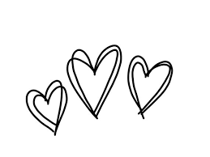

<html lang="en">
<head>
    <meta charset="UTF-8">
    <meta name="viewport" content="width=device-width, initial-scale=1.0">
    <title>Love Letter to My Girlfriend</title>
    
</head>
<body>

    

        
        <h1>Beste Liekke,</h1>
        

            Jij bent bijzonder. Bijzonder leuk en speciaal. Elke keer als ik droom over de beste toekomst die ik ooit zou kunnen krijgen dan droom ik over ons. En wanneer wij samen wonen in een leuk huisje met een hondje en 2 lieve kindertjes. Wanneer deze droom waarheid wordt weet ik nog niet, maar waarschijnlijk duurt dit nog eventjes. Ik heb deze webpagina aangemaakt voor een eeuwig levende liefdesbrief, in ieder geval tot het internet uitvalt.
        

	

        

            Ik wil jou bedanken, voor het altijd er voor me zijn en mij aan het lachen brengen. Samen kunnen wij ontzettend veel lol hebben, iets dat ik nog nooit met iemand anders heb gehad en ook waarschijnlijk niet zal krijgen (misschien wel als ik kinderen heb dan met hun ook). Het is de laatste tijd een beetje zwaar voor jou geweest, maar toch blijf je door gaan! Ik ben hartstikke trots op hoe jij als persoon de laatste jaren hebt ontwikkeld. Ik merk dat je meer zelfstandig, liefdevol, begripvol en een heel erg klein beetje meer optimistisch bent geworden.  Ik heb een paar foto's toegevoegd op deze site omdat die foto's mij goud waard zijn. 
        

        

            <!-- Add your pictures together here -->
            
	    
             
	    
	    
	    
            
            <!-- Add more pictures as needed -->
        

        

            Het leukste aan jou is je glimlach; de laatste dag dat ik die zie is de laatste dag dat ik blij zal zijn (lekker cliché). Maar het is wel grotendeels waar. Je lach is verslavend, en ik zal alles doen om hem zo vaak mogelijk te kunnen zien en horen. Ik hou van je!
        

        

        

            Forever yours,
             
            Thomas
        

        
    

</body>
</html>
